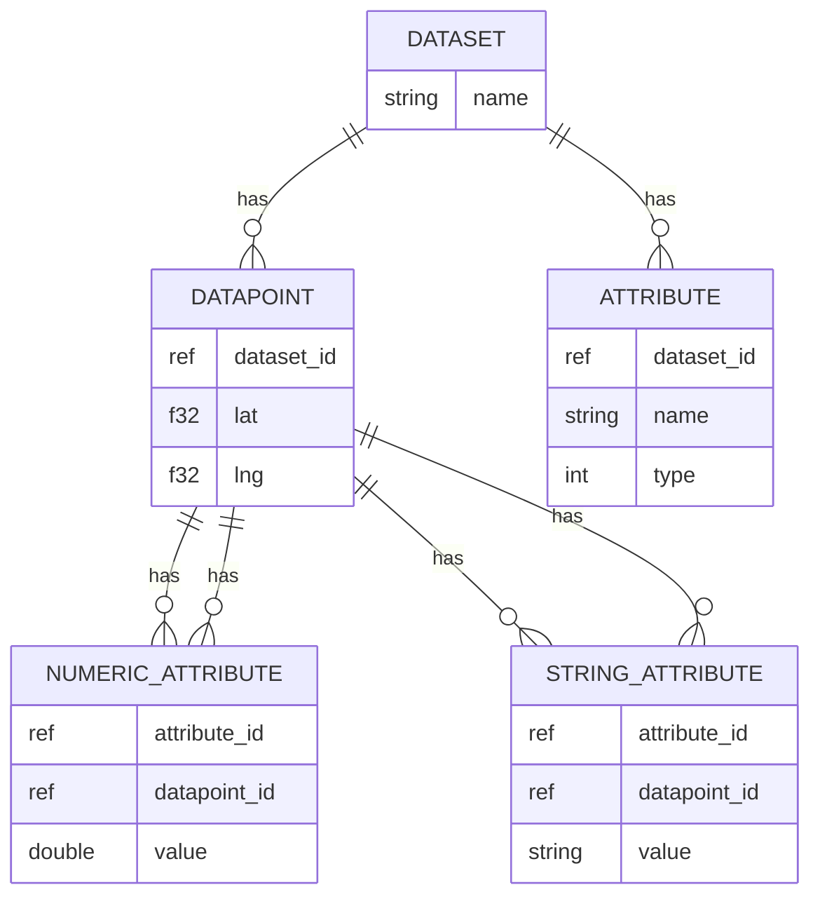

# geography data mapper

Geography data mapper is a simple service that draws datasets on a map.

## Data layout 

```mermaid
erDiagram
    DATASET ||--o{ DATAPOINT : has
    DATASET ||--o{ ATTRIBUTE : has
    DATAPOINT ||--o{ NUMERIC_ATTRIBUTE : has
    DATAPOINT ||--o{ STRING_ATTRIBUTE : has
    DATAPOINT ||--o{ NUMERIC_ATTRIBUTE : has
    DATAPOINT ||--o{ STRING_ATTRIBUTE : has

    DATASET {
        string name
    }
    
    DATAPOINT {
        ref dataset_id
        f32 lat
        f32 lng
    }

    ATTRIBUTE {
        ref dataset_id
        string name
        int type
    }
    
    NUMERIC_ATTRIBUTE {
        ref attribute_id
        ref datapoint_id
        double value
    }
    
    STRING_ATTRIBUTE {
        ref attribute_id
        ref datapoint_id
        string value
    }
```

