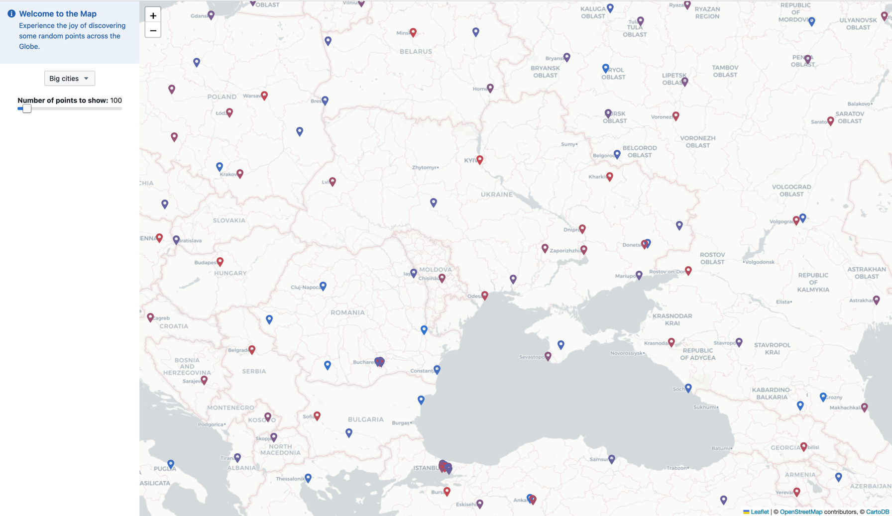
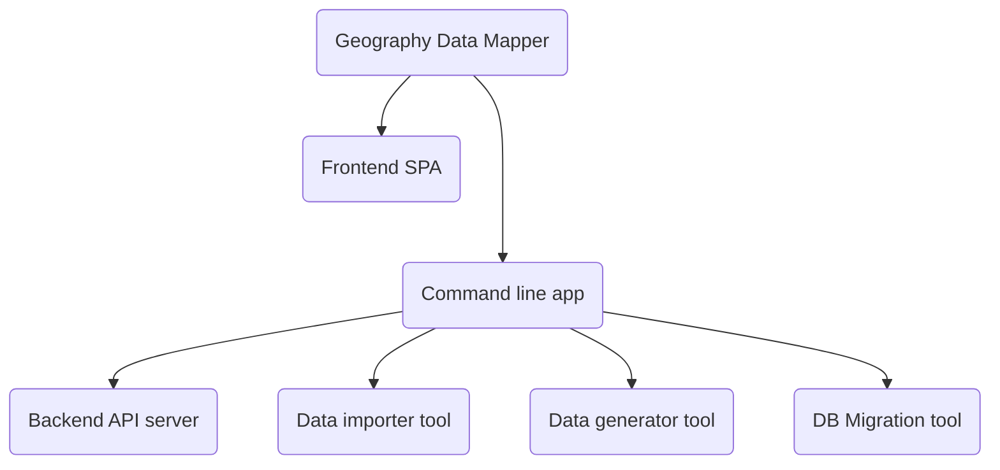
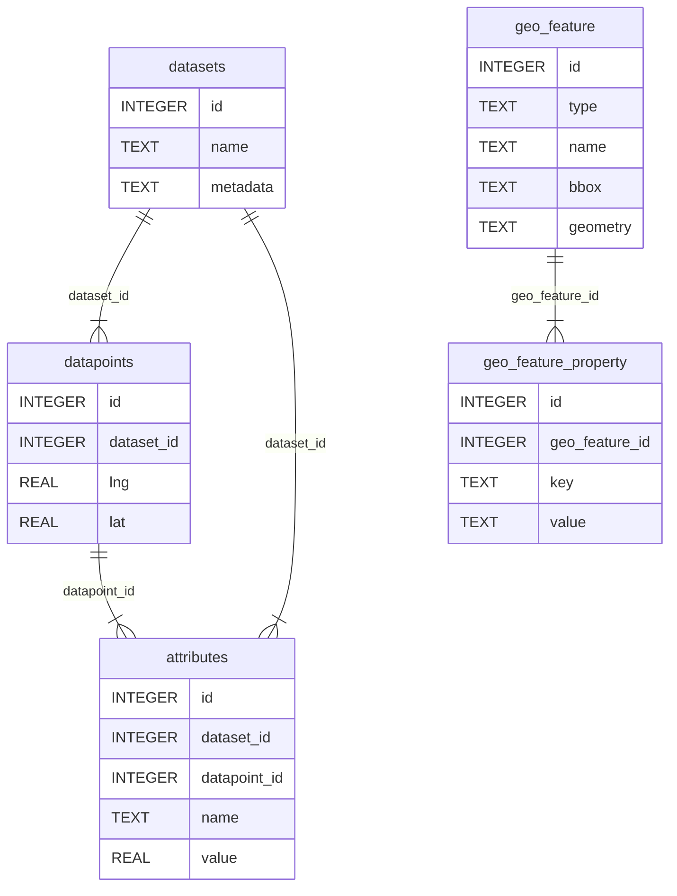

# Geography Data Mapper

Geography data mapper is a simple service that draws datasets on a map.
See it live on https://geomap.vadikk.com/




### Goals and status of the project
This project is not intended for production use. It is a playground for me to try out 
new technologies and learn new things. Nonetheless, the project is live and can be used to draw 
static datasets on a map and serve low-to-medium traffic and can be hosted on a cheap VPS.

### Architecture


here is the help output of the command line app:

```
Usage: geography-data-mapper <COMMAND>

Commands:
  server            starts server
  generate          generates fake data
  migrate           run all pending migrations
  import-geo-json   
  import-geo-names  
  help              Print this message or the help of the given subcommand(s)

Options:
  -h, --help     Print help
  -V, --version  Print version
```

Run `geography-data-mapper <COMMAND> --help` for more information on a specific command.

## Database
The project SQLite database.
The path to the database can be configured using the `SQLITE_DB_PATH` environment variable.

Run `geography-data-mapper migrate` to create the database file and run all migrations.


### Data layout 



### Populating the database
The project comes with a tool to:
- import data from GeoJSON files, 
- [geonames](http://download.geonames.org/export/dump/) 
- generate random data

Look into [./app/taskfile.yaml](./app/taskfile.yaml) to see how to use it.

## Frontend
The frontend is a single page application written in React, NextJS.
It uses SWR for fetching data from some endpoints, but it seems an overkill for this project.

## Backend
The backend is a simple API server written in Rust using [Rocket](https://rocket.rs/) and 
[rusqulite](https://docs.rs/rusqlite/latest/rusqlite/) for database access.

### API
The API follows REST principles whenerver applicable, however, it is a read-only API.


#### GET /api/datasets
Returns a list of datasets.
```js
[
    {
        "id": 1,
        "name": "dataset 1",
        "metadata": {
            "some": "metadata"
        }
    },
    {
        "id": 2,
        "name": "dataset 2",
        "metadata": {
          "some": "metadata"
        }
    }
]
```

### GET /api/datapoins?dataset=1
Returns a list of datapoints for given dataset. `dataset` is a required parameter and must 
be an ID of dataset.

there are optional query parameters
```
  offset: i32 - offset of the first datapoint to return. default 0
  limit: i32 - limit of datapoints to return. default 100
  order_by: String - order by column. default "id"
  lat_max, lat_min, lng_max, lng_min : f32 - filter datapoints by lat/lng  
```

**Disclaimer**: The API might not be properly implemented according to this documentation.
In practice, it was only tested with client providing all the query parameters. 

## Deployment
Deployment is done locally using [taskfile](./infra/taskfile.yaml), no CI/CD is used.
There are folowing deployment steps: 
- build the frontend and backend
- bundles them all into a single docker image 
- unload the image to a remote machine. No intermediate regestry is involved.
- create remote docker-compose and .env files
- start/restart the service

It is expected that remote environment has [traefik](https://traefik.io/) proxy installed and 
configured to read docker labels and route traffic to the service. 